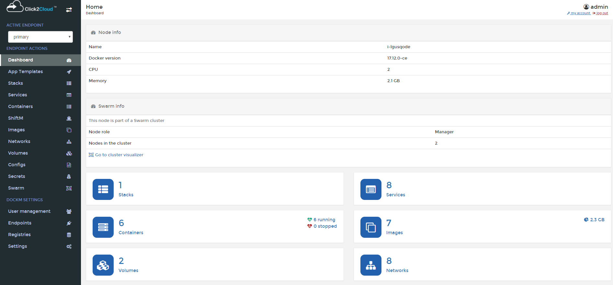
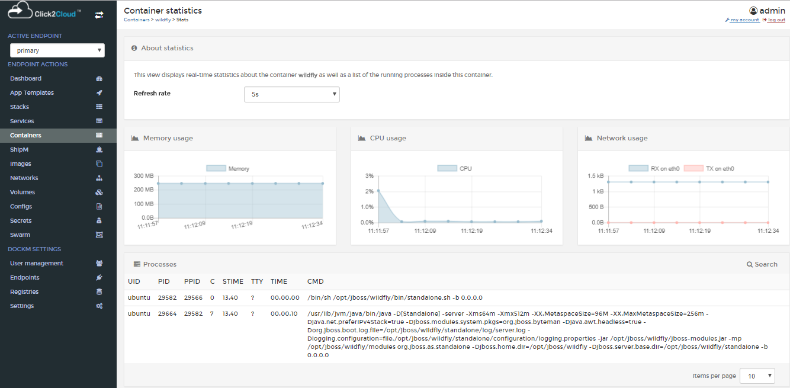
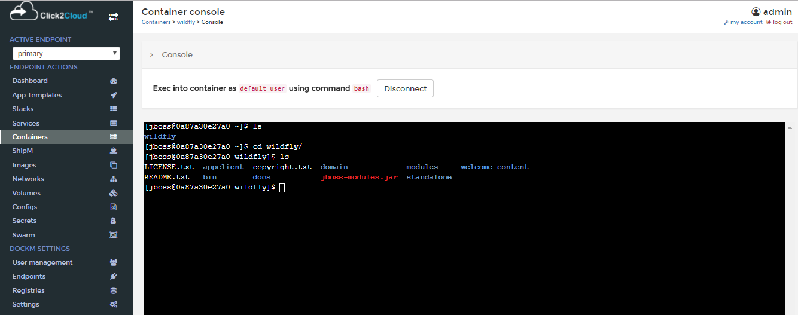
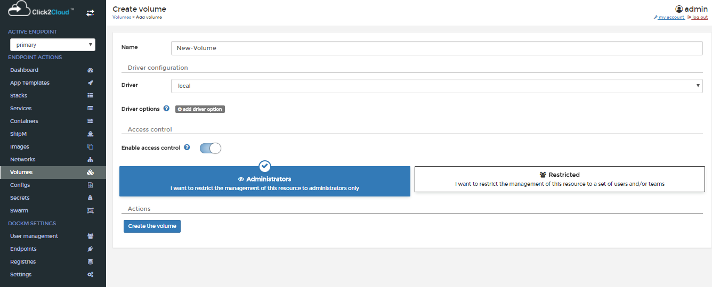
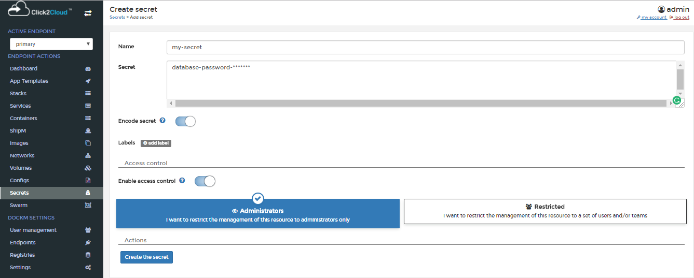
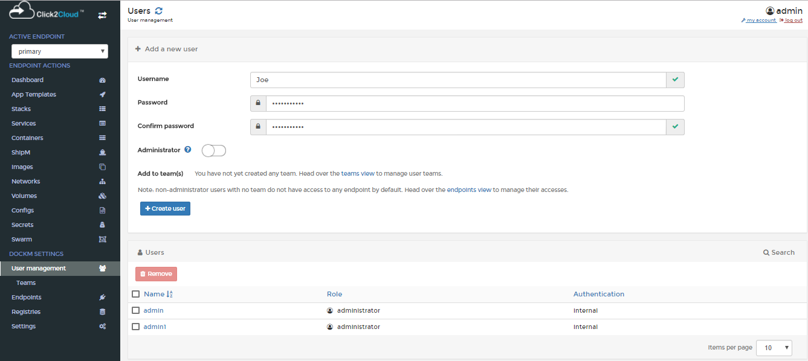
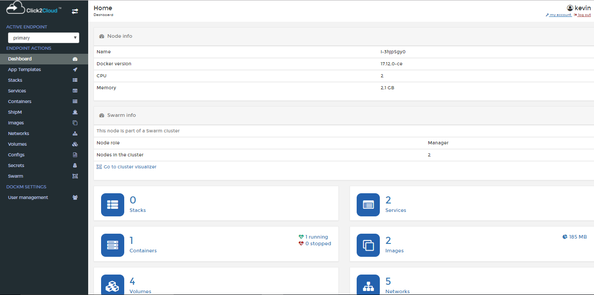
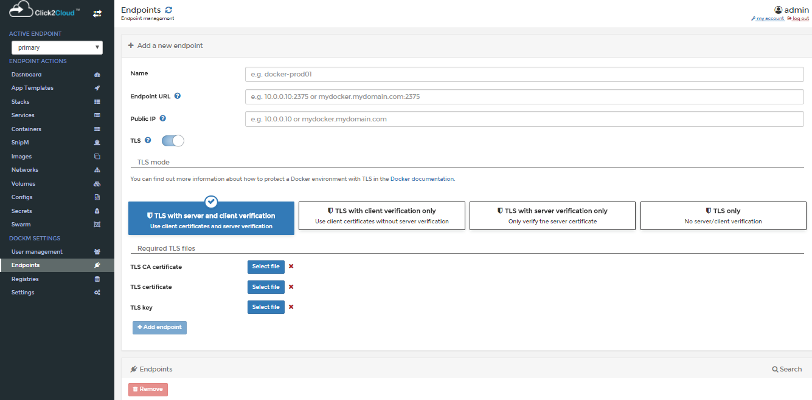
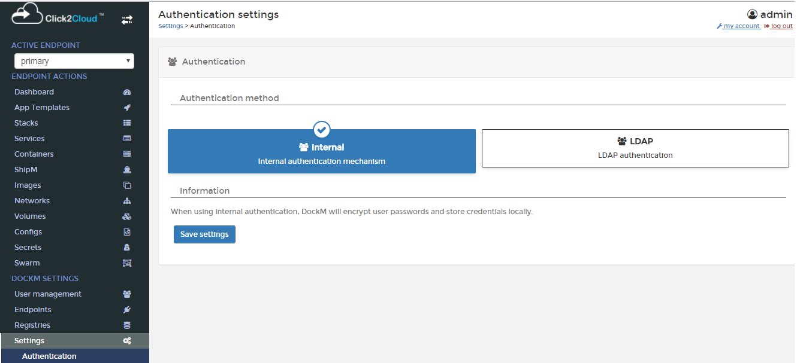

# Click2Cloud DockM

**DockM** is a lightweight management UI which allows you to easily manage the containers running on Docker hosts or Docker Swarm clusters. It is a platform for automating deployment, scaling the containerized applications across clusters of hosts.
The goal of DockM on QingCloud AppCenter is to help end users easily set up a Docker swarm cluster with preconfigured DockM tool in just few minutes. It also supports cluster horizontal scaling, vertical scaling, node monitoring and alarming etc.

## How to deploy Click2Cloud DockM

### Active Endpoints
Lists the endpoints for which the user is authorized by the Administrator.

### Endpoint Actions 
This section provides the detailed overview of Docker and allows you to manage stacks, services, containers, images, networks, volumes and swarm.

### Dashboard
Dashboard page displays the running and stopped containers, number of downloaded Docker images, number of volumes and networks. You don’t have memorize Docker commands. Everything can be done from the Dashboard itself.

 

### App Templates
The App Templates page shows some ready-made available templates such as Docker image registry, Nginx, Httpd, MySql, WordPress etc. You can create your own custom templates by specifying the path of JSON file of GitHub repository, local system from Settings tab.

To deploy a Container, just click on the respective template. Let us launch Redis Container. To do so, click on the Redis template. Enter the Container name, select network type (ex. bridge mode). click on Show advanced options and set port number.
Finally, Click Create.

#### LinuxServer.io
App Templates contains another tab `LinuxServer.io` which shows images related to Linux environment.

### Stacks
Multi-container Docker applications can be run on a single Docker engine by using stack files. Stack file defines environment variables, deployment tags, the number of containers, and related environment-specific configuration.
Copy the contents of docker-compose.yml file in the provided web-editor text box and create the stack. We can also upload or specify the path of GitHub repository for your docker-compose.yml file.

The stacks list displays the created stacks, status, service count and deployment hosts.

### Services
Services allows the Docker engine to know about the state of the services that we want `up` at all times. Now that the engine knows about the desired state, it can take immediate measures to correct things when the actual state differs. If a container dies unexpectedly at any time, the engine can bring another one up automatically. If an entire node goes down taking a few containers with it, the engine detects it and can bring these containers back up on a healthy node.

The service created by using service option can be schedule as Global, Replicated. We can also create the entry points, working directory, networks, mapped volumes etc.

### Containers
The Containers page that shows the list of running and Stopped containers.

 
To create a Container, just hit `Add Container` button on the top. Enter the Container name and Image name. click on map additional port and set port number.
Finally, Click Start Container.

  
 
To view the complete overview of any container, just click on the name of the container.

  

Click on the `Stats` button to view what’s happening in the newly launched Container.

   

Similarly, click on the `Logs` button to view complete log details of the Container.

Another notable feature is you can easily connect to the console of your Container by clicking on the `CONNECT` button.

 

You can see the Console of the container, and disconnect it by clicking on `DISCONNECT` button.

 

### ShipM
`ShipM` can be used for building Docker images from source code. It produces ready-to-run images by injecting source code into a Container and letting the Container prepare that source code for execution. By creating self-assembling builder images, we can version and control your build environments exactly like we use Docker images to version our runtime environments.
The Builder image name is nothing but the Docker image to be used in building the final image.
The Source Code URL is the URL of a Git repository or a local path to the source code.
The New image name is the name of the final Docker image.
Here We can see the Complete Build logs. 

### Docker Images
In this section, we can view the list of downloaded docker images. 

 
You can pull the image from any docker registry by specifying the image name.

To view the complete overview of any image, just click on the name of the image.

To remove any image, just select it and click Remove. The selected image will be removed.

### Networks
This section allows to add a new network, change the network type, assign/change IP address, remove existing networks.

Clicking on `Add network` button shows the Create network page providing the options for Name, Subnet, Gateway, Driver, Driver options, Labels for the network.

 
### Volumes
Here we can view existing Docker volumes, create new one, delete them if we no longer need them.

Clicking on `Add volume` button shows the `Create volume` page containing Name, Driver, Driver options, Access control options.

### Configs

`Configs`, allow you to store non-sensitive information, such as configuration files, outside a service’s image or running containers.
This allows you to keep your images as generic as possible, without the need to bind-mount configuration files into the containers or use environment variables.

### Secrets
This section allows to add a secret and remove existing secrets. We can see the added secrets list with the created date and time.

 
Clicking on `Add secret` button shows the `Create secret` page containing Name, Secret, Encode options, Labels.

To remove any secrets, just select it and click `Remove`. The selected secrets will be removed.

### Swarm
In Swarm, we can see the Cluster overview which is nothing but Cluster status and Node status, which Manage the swarm.

## DockM Setting
This section provides the option for User Management, Endpoints, Registries and, Application Settings.

### User Management

### Administrator User
Administrator User can create other Administrator Users, Normal Users. Administrator user can be created by enabling the Administrator button, and clicking on `Create user` button.

Only the Administrator User is responsible to Authorize Users, Teams, Team Leaders for the specific Endpoint.
Administrator User is the only person who has control over all the tabs in the DockM application.	
### Team
### Users
Administrator User can create many normal and Administrator User from the Users tab. A normal user can be created without enabling the Administrator button. Enter the Username and Password. click on `Create user` button.

Clicking on `Teams` view shows the Teams page providing the options for Name and select box for the Selecting team leader.

 
Click on created team to check the assignment of team leader.  

 
After logging in into the application, Normal User can only see the tabs present under Endpoint Actions view and cannot see the tabs under `DockM Settings` view. Normal User can switch in between the Endpoints which are authorized by the Administrator.

 
### Team Leader: 
Team Leader can only see the User Management, Teams tab from the DockM Settings view, Team Leader can add other users in the team which is created by Administrator, unless the user is authorized for the endpoint by Administrator the user will not be able to log in into the application.

 
Clicking on Teams tab, shows the Team Details page. We can add and remove the Users from the Team. Simply click on a user to move it from one table to the other.

### Endpoints
This tab provides the option to create the Endpoints, only Administrator User can create the Endpoints and validate TLS certificates. 

By using manage access option Administrator User gives the permission to Users, Team Leaders

 
Clicking on Manage Access, shows the Endpoint Access page. In this page, we can select which user or team can access this endpoint by moving them to the authorized access table. Simply click on a user or team entry to move it from one table to the other.
 
### Registries
Registries contains the all available registries. Administrator can Update and add registries. 

 

Administrator can create another custom registry. Clicking on Add Registry buttons shows the Create Registry page with the options Quay.io and Custom registry. For adding Quay.io i.e. Quay container registry provide Registry Details as Username and Password.

You can create your own custom registry by providing the options for Registry Details as Name, Registry URL and Authentication for Custom registry.
In Authentication tab provide the Username and Password.
 
### Settings
Settings contains all the Application settings and all hidden container settings

Administrator User can add the Custom Logo by specifying the URL with specified image dimensions. By enabling the Use custom templates option, you can create your own custom templates by specifying the path of JSON file of GitHub repository. If you don’t want external contributions such as Linuxserver.io in the side bar, you can hide it by enabling the Hide external contributions. 

#### Authentication
There are two type of Authentication methods one is Internal and second is LDAP authentication.
When you are using Internal authentication DockM will encrypt user passwords and store credentials locally.

When you are using LDAP authentication, DockM will delegate user authentication to a LDAP server. Exception for the admin user that always uses internal authentication.

 

